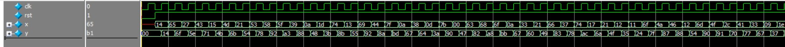

# Weighted Average Moving Filter
## Table of content
- [Weighted Average Moving Filter](#weighted-average-moving-filter)
  - [Table of content](#table-of-content)
  - [Introduction](#introduction)
  - [RTL Implementation](#rtl-implementation)
  - [TestBench and Simulations](#testbench-and-simulations)
## Introduction
focused on implementing a Weighted Moving Average (WMA) filter. The specified filter coefficients are **H = [1, 0.5, 0.25, 0.125]**, which represent the weights applied to the input sequence for the averaging operation. This filter is designed in **transposed form**, commonly used structures in digital filter implementation.

Weighted Moving Average Filter: A type of Finite Impulse Response (FIR) filter that calculates a weighted average of a fixed number of input samples. The weights are predefined and applied to the current and past input values to compute the output.**The filter operates at a sampling frequency of 100 MHz**.

 
***Figure 1: Filter Diagram***

The diagram provided shows a basic filter structure, representing how the weighted input values are summed after being delayed by unit delays (represented by z<sup>-1</sup> ). 

## RTL Implementation

``` sv 
module trans_form #(parameter N=4)( input clk,rst,
                    		    input [N-1:0] x,
                    		    output reg [N-1:0] y);
reg [N-1:0] x_1,x_2,x_3;                                  
always@(posedge clk,negedge rst)
  begin
    if(!rst)
      begin
        y<=0;
        x_1<=0;
        x_2<=0;
        x_3<=0;
      end
    else
      begin
        x_1<=(x>>1)+x_2;
        x_2<=(x>>2)+x_3;
        x_3<=(x>>3);
        y<=x+x_1;
      end
  end
endmodule
```
## TestBench and Simulations
The test bench used a random inputs form input1.txt and then calculate the output then comparing it to the reference output from the output1.


***Figure 2: Simulation waveform 1***


***Figure 3: Simulation waveform 2***


***Figure 4:  Test Cases check***